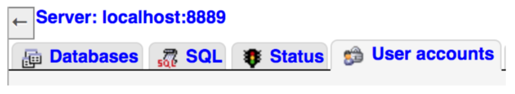
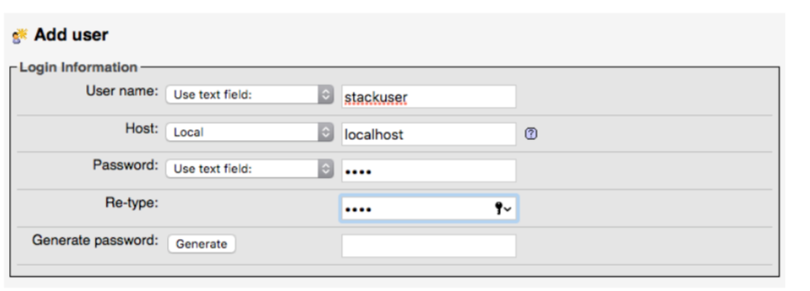

# PDO

## LEARNING OBJECTIVES

- **SQL queries** in PHP
- Gebruik van de **PDO klasse**

## CONFIGURATIE DATABASE

Nu we zowel met PHP als met een MySQL database gewerkt hebben is het tijd om deze samen te voegen. We zullen nu zien hoe we SQL queries kunnen uitvoeren vanuit onze eigen PHP pagina's.

We zullen opnieuw gebruik maken van de stackoverflow database van de vorige reeks oefeningen. Vooraleer we deze kunnen aanspreken in PHP, maken we een **gebruiker aan met rechten op die database**. 

Het is namelijk niet aan te raden om met je **root gebruiker** te werken. Dit is de gebruikersaccount die alles kan op je mysql server, en gebruik je **enkel voor serverbeheer** (zoals databases & users aanmaken).

### USER AANMAKEN

- Surf naar jouw lokale **phpMyAdmin**, en klik op **Users** in het overzichtsscherm. 

- Klik in dit scherm op “**Add user account**”. Vul het formulier Login Information in, en klik onderaan de pagina op Go / Start. 

- Klik na het toevoegen op de link ‘Database’ (naast Global). 


- In de sectie “**Database-specific privileges**” selecteer je de stackoverflow database. Klik op Go.

- Je wordt geredirect naar de rechten van die user op de stackoverflow database. Selecteer op die pagina in de sectie “**Database-specific priveleges**” alle privileges, behalve Administration en klik op Go / Start. 

- Je hebt nu een user, die enkel de stackoverflow database kan query-en. Dit is belangrijk naar beveiliging van je database server toe. Als iemand de logingegevens van die gebruiker zou bemachtigen, dan kan die enkel maar in de stackoverflow database dingen uitspoken.

## DATABASE CONNECTIE MET PHP

[De PDO klasse](http://php.net/manual/en/class.pdo.php) of **PHP Data Objects** klasse maakt het mogelijk om vanuit **PHP met je database te verbinden**.
Online kan je wel eens voorbeelden met mysql of mysqli functies vinden, maar deze zijn vaak verouder, onveilig en onhandig om mee te werken.

### PDO OBJECT AANMAKEN

Om te verbinden met een database maken we een PDO object aan. Hiervoor voorzien we **4 parameters**:

- host
- database naam
- username
- password

De verbinding met de stackoverflow database ziet er als volgt uit:

```php
<?php

$pdo = new PDO("mysql:host=localhost;dbname=stackoverflow", "root", "root");

?>
```

### SQL QUERY UITVOEREN

Nu er een verbinding met de database is aangemaakt is, kunnen we SQL querys uitvoeren.
Een SQL query uitvoeren vanuit een PHP bestand gebeurt in 4 stappen:

- Query schrijven
- Query preparen
- Query uitvoeren
- Resultaten opvragen


1. Query schrijven
	
	```
	<?php
	
  	$pdo = new PDO("mysql:host=localhost;dbname=stackoverflow", "root", "root");
  	
	$sql = "SELECT * FROM users";
	
	?>
	```
	
2. Query preparen

	Voor we deze query ook effectief uitvoeren zullen we deze **preparen**. Dit doen we met 	behulp van de [prepare functie](http://php.net/manual/en/pdo.prepare.php). Deze stap 	beveiligt je query voor SQL injection.
	
	Deze functie returned een [PDOStatement object](http://php.net/manual/en/class.pdostatement.php) 
	
	```php
	<?php
	
	$pdo = new PDO("mysql:host=localhost;dbname=stackoverflow", "root", "root");
	
	$sql = "SELECT * FROM users";
	
	$statement = $pdo->prepare( $sql );
	
	?>
	```
	
3. Query uitvoeren
	
	Roep de `execute` methode op van het statement object dat je terug krijgt van de prepare functie.
	
	```
	<?php
	$pdo = new PDO("mysql:host=localhost;dbname=stackoverflow", "root", "root");
	$sql = "SELECT * FROM users";
	$statement = $pdo->prepare( $sql );
	
	$statement->execute();
	?>
	```
	
4. Resultaten opvragen

	- Via de `fetchAll` methode op het statement object (als je x resultaten verwacht)
	- Via de `fetch` methode op het statement object (als je 1 resultaat verwacht)
	- Mogelijkheid om via argument te bepalen hoe je de resultaten terug krijgt.
	- Standaard nemen we PDO::FETCH_ASSOC

	```
	<?php
	$pdo = new PDO("mysql:host=localhost;dbname=stackoverflow", "root", "root");
	$sql = "SELECT * FROM users";
	$statement = $pdo->prepare( $sql );
	$statement->execute();

	$results = $statement->fetchAll( PDO::FETCH_ASSOC );
	?>
	```
	
	De results variabele bevat nu een array met alle rijen die je hebt geselecteerd als een associatieve array

	```
	echo '<pre>';
	var_dump( $results );
	echo '</pre>';
	```
	
### VARIABELEN IN QUERIES

Gebruik nooit variabelen in je SQL queries! Dit maakt je website kwetsbaar voor SQL injection. Gebruik dus steeds prepared statements.

```
<?php

//gebruik een placeholder in je SQL query
$sql = "SELECT * FROM users WHERE `id`=:id";

//prepare je statement
$statement = $pdo->prepare( $sql );

//vervang de placeholder via de 'bindValue' method
$statement->bindValue(":id", $_GET["id"]);

//voer tenslotte je statement uit
$statement->execute();
?>
```


## EXERCISES

In de map startbestanden vind je een reeks voorbeelden en oefeningen op database connectie met PHP.

