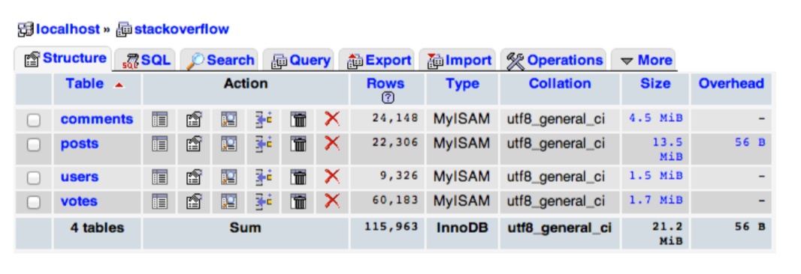

# SQL

## Learning Objectives

- Databasebeheer
- SQL statements

## PHPMYADMIN

Voor deze oefeningen zullen jullie de tabellen & hun data aangeleverd krijgen in zo’n sql file (vaak ook een sql-dump genoemd). Tabellen zijn een onderdeel van een database, dus vooraleer je ze kan importeren, moet je natuurlijk een database hebben.

> Voor zij die met docker werken is er ook een docker-compose.yml voorzien

### DATABASE AANMAKEN


1. Start je php server op en surf naar http://localhost:8888. PhpMyAdmin is een php applicatie die je toelaat om op een gebruiksvriendelijke manier databasebeheer te doen.
2. Klik op het tabblad databases en vul het formulier in  Als databasenaam neem je “stackoverflow” en als collation zullen we altijd utf8_unicode_ci gebruiken.
3. Na het aanmaken verschijnt de database in de linkerkolom. Klik op de database om deze te openen in phpMyAdmin.

### SQL BESTAND IMPORTEREN

Je krijgt de melding dat er nog geen tabellen aanwezig zijn in de database. Wanneer je met eigen databases zal werken, zal je zelf tabellen aanmaken. Wij zullen voor deze oefening werken met geïmporteerde tabellen.

1. Klik op het tabblad **import**: 
2. Kies het bestand stackoverflow.sql uit de bronbestanden, en klik onderaan de pagina op Go.

### TABELSTRUCTUUR RAADPLEGEN


1. Klik op de tabel posts in de linkerkolom
2. Zorg dat je op het tabblad Structure zit.
3. Wat is de primary key? Hoe zie je dit?
4. Hoeveel verschillende datatypes worden gebruikt in deze tabel?
5. Hoeveel rijen zitten in deze tabel?

### GEGEVENS RAADPLEGEN

1. Klik op het tabblad browse
2. Sorteer de rijen aflopend op creation_date (nieuwste eerst)
3. Bekijk de query die bovenaan verschijnt.
4. Hoeveel resultaten zijn er?
5. Hoelang duurde het om deze query uit te voeren?

### GEGEVENS AANPASSEN
1. Klik op het edit-icon naast de meest recente post om naar het bewerk-form te gaan.
2. Pas de view_count aan naar 1, en haal de smiley weg op het einde van de body.
3. Klik op Go onderaan het formulier om de wijzigingen op te slaan.
4. Bekijk de UPDATE query bovenaan de pagina.

### GEGEVENS INVOEREN
1. Klik op het Insert tabblad
2. Vul het formulier in.
3. Klik op Go.
4. Bekijk de INSERT query bovenaan de pagina.

### GEGEVENS WISSEN
1. Ga naar het tabblad browse
2. Sorteer aflopend op id (grootste id bovenaan)
3. Je zal zien dat dit de post is die je zopas invoerde.
4. Hoe komt het dat deze een id heeft, ondanks het feit dat wij geen waarde
invulden?
5. Klik op het delete icon naast deze rij.
6. Bekijk de query die verschijnt in het bevestigingswindow.
7. Druk op Ok om de rij te wissen.

### EXPORTEREN DATABASE
Je kan ook zelf exports maken van tabellen uit je database. Dit om backups te nemen van je gegevens, of om een database over te zetten naar een andere server.

1. Klik bovenaan de pagina op je databasenaam om naar het overzicht van je database te gaan. 
2. Klik op het tabblad Export.
3. Kies voor Custom – display all possible options.
4. Selecteer bij Output “Save output to a file”
5. Klik onderaan op de knop Go om de SQL dump aan te maken.

### WISSEN ALLE GEGEVENS UIT EEN TABEL
Soms wil je alle gegevens uit een tabel wissen, bijvoorbeeld om alle testdata te verwijderen alvorens je een project online zet.

1. Selecteer de tabel posts
2. Selecteer het tabblad Operations
3. Bekijk de waarde die staat bij de AUTO_INCREMENT. Wat wil dit zeggen?
4. Klik op de link “Empty the tabel (TRUNCATE)”
5. Ga naar Browse: je merkt dat alle waarden verwijderd zijn.
6. Bekijk opnieuw de AUTO_INCREMENT waarde. Hoeveel is deze nu?


### WISSEN TABEL

Naast het legen van een tabel, kun je ook een volledige tabel (structuur + data) wissen.

1. Selecteer de tabel users.
2. Klik op het tabblad Operations
3. Klik op de link “Delete the table (DROP)” en bevestig.
Je kunt dit ook doen vanuit het database overzicht.
1. Navigeer naar het overzicht van je database, door bovenaan op de naam van je database te klikken.
2. Bekijk de actie-icons die vermeld staan naast elke tabel. Wat wil elk van deze zeggen?
3. Wis de tabel comments via het juist icon.

### OPNIEUW IMPORTEREN DATABASE

We zullen onze export van daarnet opnieuw importeren:

1. Klik op het tabblad Import op de overzichtspagina van jouw database.
2. Selecteer het bestand dat je daarnet exporteerde & klik op Go.
3. Je krijgt een foutmelding: 
4. Dit komt omdat we een reeds bestaande table opnieuw proberen aan te maken.
5. Wis alle tabellen uit je database.
6. Test het importeren opnieuw. De tabellen worden opnieuw aangemaakt.

### EXPORT-IMPORT WORKFLOW
Het is nogal omslachtig om bij elke her-import manueel alle tabellen te moeten wissen. Je kunt er echter voor zorgen dat dit automatisch gebeurt, door de juiste instellingen te gebruiken bij het exporteren van je database.

1. Klik opnieuw op Export
2. Kies voor Custom & vink save output to a file aan
3. Vink ook ADD DROP TABLE / VIEW / ... aan bij de Object creation options.
4. Klik op Go om een nieuw .SQL bestand aan te maken.
5. Klik meteen op import en test het importeren van het zopas aangemaakte
bestand.

## DOORZOEKEN VAN TABELLEN

Tabellen zullen we doorzoeken door het schrijven van SQL statements. Voor we deze manueel zullen typen, zullen we gebruik maken van de ingebouwde zoekfunctie in phpMyAdmin.	

### SEARCH FORM
1. Klik op de tabel posts
2. Selecteer het tabblad Search
3. Selecteer bij title het gelijkaan-teken en vul in “reinstalling xcode”.
4. Klik op Go.
5. Wat is het id van de post die gevonden werd?
6. Bekijk de SQL code die phpMyAdmin genereerde. Tip: klik op Edit om de
“pure” query te zien, aangezien phpMyAdmin extra SQL gebruikt bij het renderen van de HTML. Welke parameters zijn dit?

Zoek daarna ook volgende zaken op via het zoekformulier. Bekijk telkens de pure SQL query die gegenereerd werd:

1. De post met titel “Flash on OS X Lion”
2. Posts waarin “flash plugin” in de titel staat.
3. Posts met minimum 15000 views
4. Posts die een accepted_answer_id hebben
5. Posts waarin de owner_user_id gelijk is aan de last_editor_user_id
6. Posts waarin de owner_user_id gelijk is aan de last_editor_user_id en deze
verschillend is van 0.
7. Posts met een score die groter gelijk aan 10 of gelijk aan 15. Wat merk je?


### CUSTOM SQL QUERIES
Bij de laatste zoekopdracht merkte je dat je met het zoekformulier geen meerdere filters op 1 veld kunt plaatsen. In zo’n geval kun je zelf de SQL query schrijven.

We zullen onze laatste zoekopdracht opbouwen met eigen SQL code. Hiervoor kun je in principe vertrekken van de gegenereerde SQL code van het zoekformulier.

1. Zoek met het zoekformulier de posts met een score groter dan 10.
2. Klik op Edit bij de gegenereerde SQL code bovenaan de pagina
3. Vul de query aan, zodat deze de extra filter voor de maximum score bevat:
```
SELECT * FROM `posts` WHERE `score` > 10 And `score` < 15`
```
4. Hoeveel resultaten zijn er?
5. Klik daarna op de score kolom om deze oplopend te sorteren (van klein naar
groot).
6. Bekijk de aangepaste query die de sortering bevat.
7. Pas de query aan (niet via de kolomkop / gui) om deze aflopend op score te
sorteren.
8. Pas de query aan om deze aflopend op score te sorteren én aflopend op
view_count.
Zoek nu volgende zaken op, door met custom queries te werken:
1. De posts met een view_count tussen 1000 en 2000
2. De posts met een closed date in de maand januari 2011
3. De comments van user 5472 met een score groter dan 0
4. Posts met flash en ipad in de titel (niet aansluitend)
5. De users uit San Francisco
6. De gemiddelde view_count in de tabel posts, afgerond op een geheel getal
(geen cijfers na de komma)
7. De gemiddelde view_count, van posts met een accepted_answer_id
8. De posts met een creation date in het jaar 2011. Zoek op hoe je met mysql
functies een jaar uit een datetime field kunt halen.

# VERVOLG

[PDO](PDO.md)
